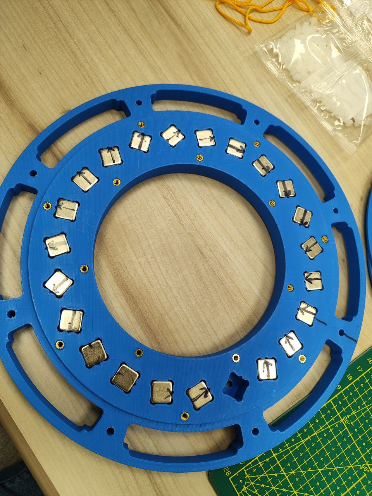
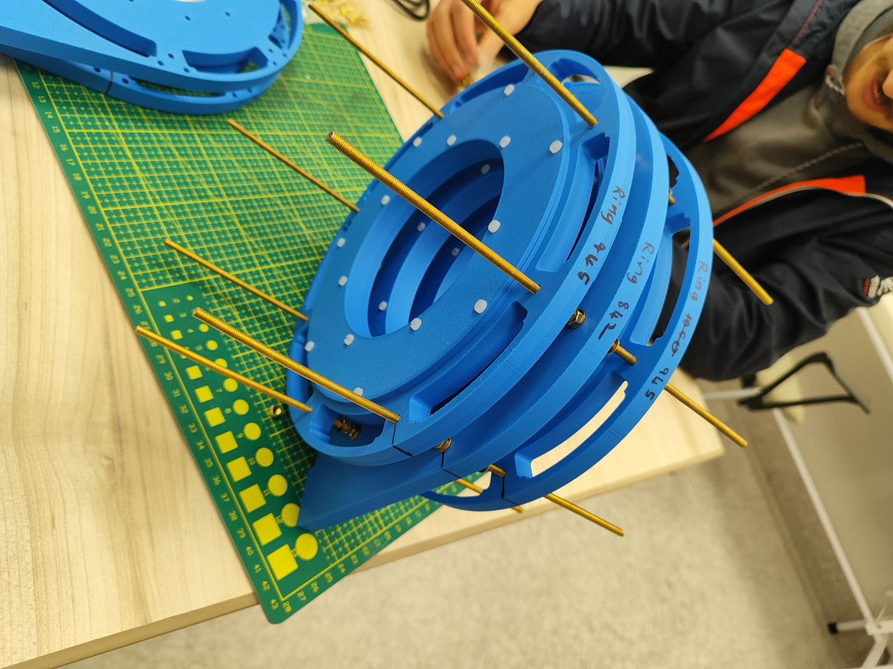
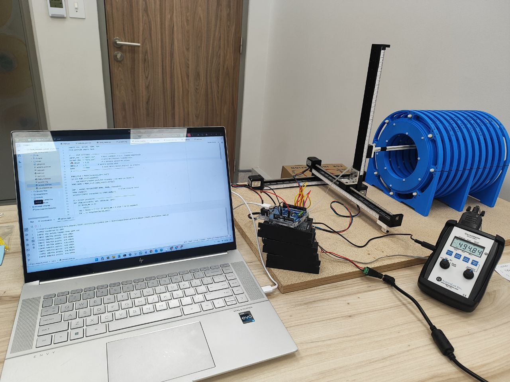
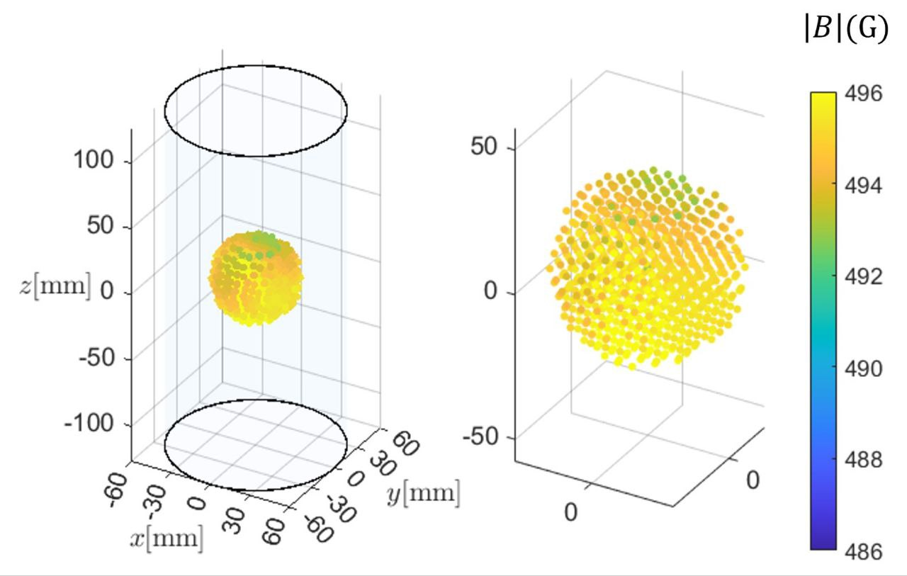

Magnet Build
============

The foundation of the scanner begins with the magnet. Strong N48 neodymium magnets are carefully positioned into circular rings.

   *Placing N48 neodymium magnets into a ring.*

Once a full ring is completed, the rings are stacked in a symmetric arrangement. This ensures stability and balanced magnetic geometry.

   *Symmetric assembly of multiple magnet rings.*

With the structure in place, the magnetic field distribution is measured. A custom robot scanned **914 points inside a 6 cm diameter sphere** to capture detailed field values.

   *Field mapping using the custom robot.*

Finally, the data is visualized in 3D. These plots confirm that the magnet design achieves the required homogeneity.

   *3D visualization showing field homogeneity.*
