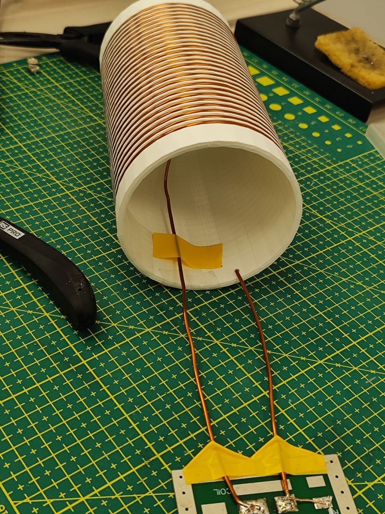

RF Coils
========

With a stable magnet in place, attention shifts to the RF hardware — essential for both transmitting and receiving signals.

The process starts with hand-winding copper wire into a solenoid coil. This simple but precise step defines the sensitivity of the system.

   *Wrapping the solenoid coil by hand.*

Next, the **transmit/receive (TR) switch** is built to alternate between exciting the spins and detecting the returning signal.

   *Assembling the TR switch.*

Shielding is added to protect the switch from external noise and unwanted coupling.

   *Shielding the TR switch.*

The electronics chain is then expanded with **filters, amplifiers, and a regulated power supply**, ensuring clean operation.

   *Adding noise filters, amplifiers, and power supply.*

Once complete, the RF assembly is installed into the scanner.

   *Placing the RF switch inside the scanner.*

With everything connected, the system is ready.

   *Whole setup*

The first **Free Induction Decay (FID)** signal marks the successful operation of the low-field setup.

   *Capturing the first FID signal.*
