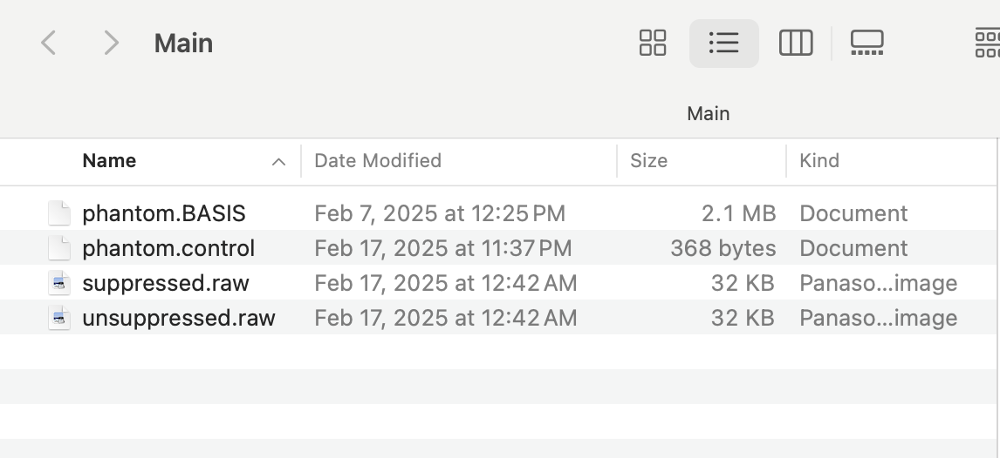

##############################################
1. Introduction to MRI Spectroscopy
##############################################

What is MRI Spectroscopy?
=========================

Magnetic Resonance Spectroscopy (MRS) is a non-invasive diagnostic test for measuring biochemical changes in the brain, especially the presence of certain metabolites. Unlike conventional MRI that produces anatomical images, MRS produces a spectrum of resonances that correspond to different chemical compounds.

Key Concepts
------------

1. **Basic Principles**
   - MRS uses the same basic principles as MRI.
   - Detects chemical compounds based on their unique resonant frequencies.
   - Provides information about metabolite concentrations.

2. **Common Applications**
   - Brain tumor diagnosis and monitoring.
   - Neurological disorders assessment.
   - Metabolic disorders evaluation.
   - Research studies.

3. **Key Metabolites**
   - N-acetylaspartate (NAA): neuronal integrity.
   - Creatine (Cr): energy metabolism.
   - Choline (Cho): cell membrane turnover.
   - Lactate: anaerobic metabolism.

----

##############################################
2. Data Acquisition and Conversion
##############################################

Overview
========

MR spectroscopy data is initially exported from the scanner as `.rda` files. However, LCModel requires data in `.RAW` format. Converting from `.rda` to `.RAW` involves more than simply renaming the file—it requires reading the data and writing it out in a compatible format.

Procedure
=========

1. **Data Export**  
   Export your raw spectroscopy data from the scanner, typically saved in the `.rda` format.

2. **Conversion with FID-A Toolbox (MATLAB)**  
   Use the FID-A toolbox to load and convert the files. The following MATLAB script demonstrates the process:

   .. code-block:: matlab

      % Add FID-A to MATLAB path
      addpath(genpath('/Users/SH7437/FID-A-master'));

      % Load the RDA files for suppressed and unsuppressed acquisitions
      in_suppressed = io_loadspec_rda('/Users/SH7437/Desktop/suppressed.rda');
      in_unsuppressed = io_loadspec_rda('/Users/SH7437/Desktop/unsuppressed.rda');

      % Set the echo time (TE) in milliseconds (update as needed)
      TE = 30;

      % Write out .RAW files for LCModel usage
      io_writelcm(in_suppressed, '/Users/SH7437/Desktop/suppressed.raw', TE);
      io_writelcm(in_unsuppressed, '/Users/SH7437/Desktop/unsuppressed.raw', TE);

Key Points
----------

* The function ``io_loadspec_rda`` reads the RDA file.  
* The function ``io_writelcm`` writes the data into the `.RAW` format needed by LCModel.  
* Adjust the TE (echo time) as per your experimental settings.  
  - Example: Glutamate/Glutamine → neurotransmitter function.

----

##############################################
3. Generating the Basis File
##############################################

Why a Basis File?
=================

The basis file is a simulated library of metabolite spectra that LCModel uses to fit your experimental data. It defines the expected spectral signatures of individual metabolites and is crucial for accurate quantification.

.. image:: graphic/basis.png
   :alt: Example of a basis file showing simulated metabolite spectra
   :align: center

Simulation Using MRSCloud
=========================

1. **Accessing MRSCloud**  
   Visit `MRSCloud <https://braingps.mricloud.org/>`_ and sign in with your credentials.

2. **Configuration for Simulation**
   * **Module:** Select "MRSCloud"
   * **Phantom Case:** Choose the phantom case that matches your experimental setup.
   * **Metabolites:** Select the corresponding metabolites (e.g., the seven metabolites present in your phantom).
   * **Simulation Settings:**
       * **Localization:** PRESS
       * **Vendor:** Siemens
       * **Editing:** unEdited
       * **TE:** 30 ms

.. image:: graphic/mrscloud1.png
   :alt: MRSCloud configuration interface
   :align: center

.. image:: graphic/mrscloud2.png
   :alt: MRSCloud configuration interface
   :align: center

|

.. image:: graphic/mrscloud3.png
   :alt: MRSCloud configuration interface
   :align: center

|

.. image:: graphic/mrscloud5.png
   :alt: MRSCloud configuration interface
   :align: center

|

.. image:: graphic/mrscloud5.png
   :alt: MRSCloud configuration interface
   :align: center

3. **Download and Extract**  
   Submit the simulation. Once processed, download the ZIP file containing the simulated basis set. Unzip the file and select the file with the `.BASIS` extension. This file will be used later in LCModel.

----

##############################################
4. LCModel Control File and Running LCModel
##############################################

Control File Overview
=====================

The LCModel control file is a plain-text file that contains parameters controlling the LCModel analysis. Running LCModel without its GUI (from the terminal) is recommended for speed and efficiency. This approach also encourages learning the nuances of the control file parameters (see LCModel manual Section 5.3).

Example Control File
====================

.. code-block:: text

   $LCMODL
     key=210387309
     nunfil=1024
     title='NYUAD Siemens 3T Phantom (PRESS, TE=30ms)'
     filbas='/Users/SH7437/Desktop/LC/phantom.BASIS'
     filraw='/Users/SH7437/Desktop/LC/suppressed.RAW'
     filps='/Users/SH7437/Desktop/LC/phantom_results.ps'
     filh2o='/Users/SH7437/Desktop/LC/unsuppressed.RAW'
     doecc = T
     nsimul = 0
     hzpppm = 123.238898
     deltat = 0.0008334
   $END

Explanation of Key Parameters
-----------------------------

* **key:** Unique identifier for the run.  
* **nunfil:** Number of unfilled points.  
* **title:** Descriptive title of the study.  
* **filbas:** Full path to the basis file.  
* **filraw:** Full path to the suppressed raw data file.  
* **filps:** Full path for the output PostScript results file.  
* **filh2o:** Full path to the unsuppressed water data file.  
* **doecc:** Boolean flag for eddy current correction.  
* **hzpppm:** Frequency in parts per million.  
* **deltat:** Time between data points.

Running LCModel from the Terminal
=================================

Compile and run LCModel from the terminal (without the GUI) using the compiled binary. This method significantly speeds up processing and allows for easier batch processing. To recompile from source, refer to the LCModel manual and available online instructions. The recommended practice is to write valid control files and run LCModel in terminal mode.

----

##############################################
5. Organizing the Main Folder
##############################################

Folder Structure
================

Create a main folder (e.g., ``/Users/SH7437/Desktop/LC``) to host all files required by LCModel. This folder should include:

* **Control File:** A text file that instructs LCModel on how to process the data.  
* **Basis File:** The `.BASIS` file generated from MRSCloud.  
* **Raw Data Files:**
  * **Suppressed Water Data:** The `.RAW` file generated from the suppressed acquisition.
  * **Unsuppressed Water Data:** The `.RAW` file for water reference data.

Keeping these files organized in one location simplifies batch processing and minimizes errors during execution.

----

##############################################
6. Additional Notes and Recommendations
##############################################

Best Practices
==============

1. **Data Organization**
   * Keep all related files in a single directory.
   * Use consistent naming conventions.
   * Maintain a log of processing steps.

2. **Quality Control**
   * Check raw data quality before processing.
   * Verify basis file matches experimental conditions.
   * Review LCModel output for convergence.

3. **Troubleshooting**
   * Common issues and solutions.
   * Parameter optimization tips.
   * Error message interpretation.

4. **Documentation**
   * Record all processing steps.
   * Document any manual interventions.
   * Keep track of parameter changes.

5. **Performance Optimization**
   * Batch processing recommendations.
   * Resource management.
   * Processing time optimization.

----

##############################################
7. LCModel Manual
##############################################

This is the official LCModel manual.

:download:`Download LCModel Manual (PDF) <files/lcmodel_manual.pdf>`
