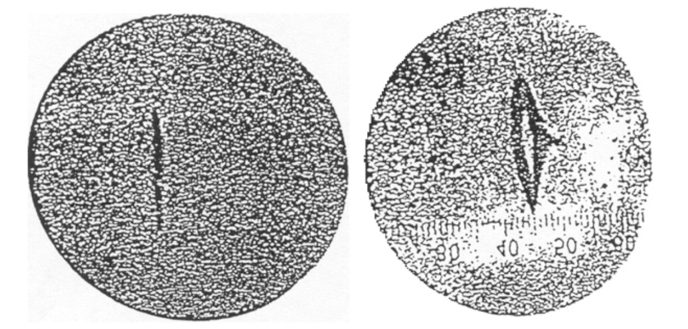

Course Introduction
===================

The role of models in learning MRI
^^^^^^^^^^^^^^^^^^^^^^^^^^^^^^^^^^

MRI is complex and multidisciplinary field having theoretical origins rooting from quantum mechanics and
utilizing the modern feet of cutting edge engineering methods to hide complexities into simple looking
tunnel-like machine.

MRI stands for Magnetic Resonance Imaging and we will take these terms as starting point by understanding
how images are constructed utilizing phenomenon of magnetic resonance. Historically magnetic resonance phenomenon
preceeds the imaging, thus we will start from the origins of magnetic resonance phenomenon.
MRI was called the most significant medical imaging invention after X ray.

The learning journey would be accompanied by models and analogies, however, before using them, its good to understand
few fundamental truths about the models.

.. admonition:: Quote
   :class: quote

      “All models are wrong, but some are useful.”

   .. container:: quote-attrib

      — George E. P. Box

.. admonition:: Quote
   :class: quote

   Imagine that … the world is something like a great chess game being played by the gods, and we are observers of the game.
   … If we watch long enough, we may eventually catch on to a few of the rules…. However, we might not be able to understand
   why a particular move is made in the game, merely because it is too complicated and our minds are limited….
   We must limit ourselves to the more basic question of the rules of the game.
   If we know the rules, we consider that we “understand” the world.

   .. container:: quote-attrib

      — Richard P. Feynman

Historical precedings
^^^^^^^^^^^^^^^^^^^^^

Stern-Gerlach Experiment
------------------------

**(Brilliant experimentally, wrong theoretically)**

Otto Stern "hated" Bohr's model so much (Calling it Bohr's nonsence) that he set up an experiment to prove it wrong.
While doing so, he created one of the most elegant ways to prove it right.
Performed at 1922, this experiment became on of the most fundamental experiments even done in quantum mechanics.

Bohr's model suggested that electrons orbit the nucleus in a discrete, quantized orbits. As electrons are charged and
moving charges created magnetic field, Otto Stern set the experiment to test whether orbital momentum and the arising magnetic fields
were quantized or not, with initial expectation that they would not.

.. image:: images/apparatus.png

The apparatus was simple, featuring a furnace to heat up silver and emit electrons and inhomogeneous magnetic field to
generate predicted normal distribution.
However, they got the contrary they expected and exactly as Bohr's model predicted: quantized distribution.

.. raw:: html

   

.. image:: images/expectation.png
   :width: 100%

.. raw:: html

   

As in 1922, the spin had not been discovered yet, they concluded their experiment with "Space Quantization" of angular momentum
which then later, would have become known as spin. The experiment was the first to prove that on atomic level, angular momentum
and resulting magnetic moment are "quantized"

The image is taken from the Stanford Encyclopedia of Philosophy [SEP]_.

.. admonition:: Nobel Prize
   :class: nobel

   .. container:: nobel-content

      .. container:: nobel-text

         The 1943 Nobel prize was awarded to Otto Stern "for
         his contribution to the development of the molecular ray method
         and his discovery of the magnetic moment of the proton"

      .. image:: /_static/Nobel_Prize.png
         :class: nobel-medal
         :alt: Nobel Prize medal

https://physicsworld.com/a/how-the-stern-gerlach-experiment-made-physicists-believe-in-quantum-mechanics/
https://plato.stanford.edu/entries/physics-experiment/app5.html
https://www.youtube.com/watch?v=pcGIBacW-q0
https://www.youtube.com/watch?v=PH1FbkLVJU4
https://www.youtube.com/watch?v=QP3SfF9H1MY

Pauli Exclusion Principle
-------------------------

Pauli came up with the idea of two possible values of the spin of the electrons: "spin up" or "spin down", and further
formulated that two electrons can't have the same spin values, known as Pauli exclusion principle.

The image is taken from the Stanford Encyclopedia of Philosophy [SEP]_.

.. admonition:: Nobel Prize
   :class: nobel

   .. container:: nobel-content

      .. container:: nobel-text

         The 1945 Nobel prize was awarded to Wolfgang Pauli for discovery of
         the exclusion principle: a fundamental principle in quantum mechanics, stating
         that no two electrons in an atom can have the same set of quantum numbers.

      .. image:: /_static/Nobel_Prize.png
         :class: nobel-medal
         :alt: Nobel Prize medal

.. rubric:: References

.. [SEP] Stanford Encyclopedia of Philosophy. *Physics Experiment, App 5*.
   <https://plato.stanford.edu/entries/physics-experiment/app5.html>_