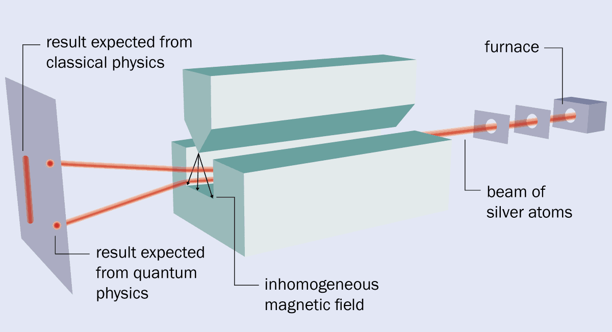

Course Introduction
===================

The role of models in learning MRI
^^^^^^^^^^^^^^^^^^^^^^^^^^^^^^^^^^

MRI is complex and multidisciplinary field having theoretical origins rooting from quantum mechanics and
utilizing the modern feet of cutting edge engineering methods to hide complexities into simple looking
tunnel-like machine.

MRI stands for Magnetic Resonance Imaging and we will take these terms as starting point by understanding
how images are constructed utilizing phenomenon of magnetic resonance. Historically magnetic resonance phenomenon
preceeds the imaging, thus we will start from the origins of magnetic resonance phenomenon.
MRI was called the most significant medical imaging invention after X ray.

The learning journey would be accompanied by models and analogies, however, before using them, its good to understand
few fundamental truths about the models.

.. admonition:: Quote
   :class: quote

      “All models are wrong, but some are useful.”

   .. container:: quote-attrib

      — George E. P. Box

.. admonition:: Quote
   :class: quote

   Imagine that … the world is something like a great chess game being played by the gods, and we are observers of the game.
   … If we watch long enough, we may eventually catch on to a few of the rules…. However, we might not be able to understand
   why a particular move is made in the game, merely because it is too complicated and our minds are limited….
   We must limit ourselves to the more basic question of the rules of the game.
   If we know the rules, we consider that we “understand” the world.

   .. container:: quote-attrib

      — Richard P. Feynman

Historical precedings
^^^^^^^^^^^^^^^^^^^^^

Stern-Gerlach Experiment
------------------------

**(Brilliant experimentally, wrong theoretically)**

Otto Stern "hated" Bohr's model so much (Calling it Bohr's nonsence) that he set up an experiment to prove it wrong.
While doing so, he created one of the most elegant ways to prove it right.
Performed at 1922, this experiment became on of the most fundamental experiments even done in quantum mechanics.

Bohr's model suggested that electrons orbit the nucleus in a discrete, quantized orbits. As electrons are charged and
moving charges created magnetic field, Otto Stern set the experiment to test whether orbital momentum and the arising magnetic fields
were quantized or not, with initial expectation that they would not.

The apparatus was simple, featuring a furnace to heat up silver and emit electrons and inhomogeneous magnetic field to
generate predicted normal distribution.
However, they got the contrary they expected and exactly as Bohr's model predicted: quantized distribution.

.. raw:: html

   

.. image:: images/reality.png
   :width: 100%

.. raw:: html

   

As in 1922, the spin had not been discovered yet, they concluded their experiment with "Space Quantization" of angular momentum
which then later, would have become known as spin. The experiment was the first to prove that on atomic level, angular momentum
and resulting magnetic moment are "quantized"

.. image:: images/result.png
The image is taken from the Stanford Encyclopedia of Philosophy [1]_.

.. admonition:: Nobel Prize
   :class: nobel

   .. container:: nobel-content

      .. container:: nobel-text

         The 1943 Nobel prize was awarded to Otto Stern "for
         his contribution to the development of the molecular ray method
         and his discovery of the magnetic moment of the proton"

      .. image:: /_static/Nobel_Prize.png
         :class: nobel-medal
         :alt: Nobel Prize medal

https://physicsworld.com/a/how-the-stern-gerlach-experiment-made-physicists-believe-in-quantum-mechanics/
https://plato.stanford.edu/entries/physics-experiment/app5.html
https://www.youtube.com/watch?v=pcGIBacW-q0
https://www.youtube.com/watch?v=PH1FbkLVJU4
https://www.youtube.com/watch?v=QP3SfF9H1MY

Pauli Exclusion Principle
-------------------------

Pauli came up with the idea of two possible values of the spin of the electrons: "spin up" or "spin down", and further
formulated that two electrons can't have the same spin values, known as Pauli exclusion principle.

.. admonition:: Nobel Prize
   :class: nobel

   .. container:: nobel-content

      .. container:: nobel-text

         The 1945 Nobel prize was awarded to Wolfgang Pauli for discovery of
         the exclusion principle: a fundamental principle in quantum mechanics, stating
         that no two electrons in an atom can have the same set of quantum numbers.

      .. image:: /_static/Nobel_Prize.png
         :class: nobel-medal
         :alt: Nobel Prize medal

The Birth of Nuclear Magnetic Resonance: NMR
--------------------------------------------

**Isidor's Rabi's extension of Stern-Gerlach experiment**

The most significant step laying the groundwork for "resonance" aspect of MRI and NMR (same R), was performed by Isidor Rabi at 1937.
He modified the Stern-Gerlach setup by adding an oscillating magnetic field and showing that they are able to change the spins.
Instead of silver atoms originally used by Stern-Gerlach, he used Lithium Chloride (LiCl). His contribution was adding a radiofrequency
coil to modify the magnetic field and then observed that it led to change in observed proportions of spin up and down electrons on the
photo plate.

With this results he claimed that it would be possible to identify individual atoms by their characteristic pattern of resonant frequency.

The image is taken from the Questions and Answers in MRI [2]_.

The simple figure shows significant decrease in beam intensity at resonant frequency, which was achieved by controlling the
amperage of radiofrequency coil (magnetic field induced by RF coil was proportional to current).

.. admonition:: Nobel Prize
   :class: nobel

   .. container:: nobel-content

      .. container:: nobel-text

         The 1944 Nobel prize was awarded to Isidor Isaac Rabi "for his resonance method for recording the magnetic properties
         of atomic nuclei".

      .. image:: /_static/Nobel_Prize.png
         :class: nobel-medal
         :alt: Nobel Prize medal

Rabi also became the first to use the term Nuclear Magnetic Resonance (NMR), which then became irreplacable technique in chemistry to understand
molecular structures.

In simpler terms the idea of magnetic resonance or resonance phenomenon in general, can be explained using a simpler analogy from
*Home Alone* movie.

When the same question is asked by the villain, Kevin gives no response, because the Villain's voice is different than a trusted
person, such as mother, to whom he gives a response. As the frequency is fundamental characteristics of the voice, we can tell that ``wrong frequency`` led ``no response``.
And similarly, when the mother "generates" the ``right frequency`` a ``response is received``.

Moving from isolated gas-phase atoms to solids and liquids (bulk material)
--------------------------------------------------------------------------

Magnetic resonance in individual atoms was already quite fascinating phenomenon, but not of quite applicability, as in daily life
we dont come across with individual atoms. Thus it was important to test on bulk matter (liquids, solids) and understand whether the same
phenomenon applies on macroscopic levels or not.

The same experiment was independently done by Felix Bloch (Standford University) and Edward Mills Purcell at MIT, where they did the experiment
with Water (Purcell's group) and paraffin (Bloch's group).

.. raw:: html

   

.. raw:: html

   

The image is taken from the Questions and Answers in MRI [2]_.

.. admonition:: Nobel Prize
   :class: nobel

   .. container:: nobel-content

      .. container:: nobel-text

         The 1952 Nobel prize was awarded to jointly to Felix Felix Bloch
         and Edward Mills Purcell "for their development of new methods for
         nuclear magnetic precision measurements and discoveries in connection therewith"

      .. image:: /_static/Nobel_Prize.png
         :class: nobel-medal
         :alt: Nobel Prize medal

Its worth to appreciate the simplicity of design featured in Bloch's notebook, which featured Nobel Prize winning research.

.. image:: images/Notebook.png

The Chemical Shift Revolution: How 1950s NMR Crossed into Chemistry
-------------------------------------------------------------------

Until 1950s only physicists were interested in NMR, because they believed that resonance frequency depends ``only`` on the strength
of the magnetic field, therefore it could `` only`` be used to precisely measure the magnetic moments of different nuclei.

An "unintentional" new revolution happened when Warren Proctor and Fu Chun Yu used ammonium nitrate (NH4NO3) to measure magnetic moment of
Nitrogen. Having 2 nitrogen (one in Ammonia and the other in Nitrate), they expected to get a single, stronger signal from the Nitrogen.

In what they described as a “surprising observation”, however, not one but two resonance
frequencies were detected — one for the nitrogen nuclei in the ammonium
:math:`\mathrm{NH_4^+}` ions and the other for those in the nitrate :math:`\mathrm{NO_3^-}` ions.

This was the first reported observation of the phenomenon that soon became known as ``chemical shift``,
in which the local chemical environment surrounding a nucleus influences the frequency at which it resonates.

In 1951, a group of researchers from Stanford University showed that different
:math:`^{1}\mathrm{H}` nuclei in the same molecule resonate at different frequencies.

James Arnold, Srinivas Dharmatti and Martin Packard demonstrated the huge potential of
NMR spectroscopy by applying the technique to ethanol (:math:`\mathrm{CH_3CH_2OH}`),
a compound in which each molecule comprises three sets of non-equivalent
:math:`^{1}\mathrm{H}` nuclei. Using tiny sample volumes and placing them in the most
uniform region within a magnetic field, they obtained a spectrum displaying three separate
lines, corresponding to the resonant frequencies of the :math:`^{1}\mathrm{H}` nuclei in the
:math:`\mathrm{CH_3}`, :math:`\mathrm{CH_2}` and :math:`\mathrm{OH}` groups, respectively.

The section is taken from the Youtube video [3]_.

Below is the same spectrum of ethanol taken by a modern NRM machine. We can appreciate the relative accuracy of the
non-commercial lab NMR scanner they used in 50s.

.. image:: image/modern.png

The image is taken from the Benchtop thoughts [5]_.

Moreover, the relative intensities of the three signals corresponded with the number of protons
in each different chemical environment. So it was possible not only to identify different
molecular fragments but also to glean quantitative information about the number of equivalent
nuclei in each.

The section is taken from the Nature Physics [4]_.

From theory to practice: first NMR machine
------------------------------------------

The first commercially available NMR:  F6 Nuclear FLuxmeter was introduced in 1949, and produced by Varian Associates.

The image is taken from the Benchtop thoughts [5]_.

However, the initial design had significant engineering limitations as  NMR data was acquired by scanning a sample across
a broad range of radio frequencies (RF), in sequence, over and over, until enough signal was obtained to be useful.
This technique, called continuous wave or ``CW-NMR`` was a time-consuming process, taking several minutes to scan a
single time; dozens, hundreds, or even thousands of scans can be required to resolve a sample.

Two solutions were proposed to tackle this issue:

First solution: Fourier Transform NMR
-------------------------------------

A solution was proposed by Ernst and Anderson, laid the ground work for ``FT-NMR``, by using short RF pulses to excite
the whole band, recording the *time-domain* FID, and applying a Fourier transform to recover the full spectrum in
*frequency domain*, an approach that, with improving computers, quickly made CW-NMR redundant.

.. admonition:: Nobel Prize
   :class: nobel

   .. container:: nobel-content

      .. container:: nobel-text

        The Nobel Prize in Chemistry 1991 was awarded to Richard R. Ernst "for his contributions to the development of
        the methodology of high resolution nuclear magnetic resonance (NMR) spectroscopy"

      .. image:: /_static/Nobel_Prize.png
         :class: nobel-medal
         :alt: Nobel Prize medal

Second solution: Superconducting Magnets
----------------------------------------

Early NMR used copper or iron-core solenoids that gave only semi-uniform fields and were limited by coil resistance,
heat, power draw, and iron’s magnetic saturation. Stronger fields promised higher resolution and faster scans, but
pushing more current just worsened heating. Superconductors (known since 1911) offered a fix: replace iron-core magnets
with superconducting coils and scale up by building larger coils. The catch was cryogenics—keeping coils at
\~4 K in liquid helium inside a liquid-nitrogen dewar—an engineering hurdle first solved commercially in 1964 with
Varian’s HR-200.

Combination of both solutions
-----------------------------
 Combination of Fourier Transform and advances in superconducting magnets, paved the way for modern high-field
NMR scanner, which can reach to 28T, bypassing the constraints of resistive and permanent magnets.

A modern NMR scanner's picture is given below:

From NMR to MRI
---------------

A reader fascinated by by MRI, may found it strange that up to now, we have not spoken about MRI, rather game much
attention to NMR. However, a close look into the letters may reveal that they share same *Magnetic Resonance* part, with
only difference being ``nuclear`` swapped with ``imaging``. As the MRI was intended for hospitals for human patients,
the marketers thought of dropping the word ``nuclear`` to mitigate the fear and wrong association with nuclear radiation,
thus a more *friendly* word was chosen: Imaging, keeping the core of **Magnetic Resonance** the same.

Early *in-vivo* hopes: Damadian’s relaxation times
--------------------------------------------------

Raymond Damadian noticed that malignant tissue had markedly longer **T₁ and T₂**
values than healthy tissue (Science, 1971).

He envisioned a body-scanner that would read out these quantitative differences,
much like “NMR applied to people,” and patented the idea in 1974.

His prototype *Indomitable* proved it could detect the human NMR signal, but its
single-voxel readout still lacked true imaging capability.

Long reads deserve short breaks—and what’s better than a quick gym burst? Legend has it Damadian missed
being the first human scanned because he didn’t fit the early rig. His grad student slid in and made history.
Moral: lift now, learn sharper later.

Adding space: Lauterbur’s gradient coils
^^^^^^^^^^^^^^^^^^^^^^^^^^^^^^^^^^^^^^^^

Paul Lauterbur supplied the missing ingredient—**gradients**.
By superimposing a weak, linear magnetic-field gradient on the main field,
the Larmor frequency became a function of position. Recording several gradient
orientations and applying a back-projection reconstruction (analogous to CT),
he produced the first 2-D NMR images (Nature, 1973).

.. admonition:: Nobel Prize
   :class: nobel

   .. container:: nobel-content

      .. container:: nobel-text

        The Nobel Prize in Physiology or Medicine 2003 was awarded jointly to
        Paul C. Lauterbur and Sir Peter Mansfield "for their discoveries concerning magnetic resonance imaging"

      .. image:: /_static/Nobel_Prize.png
         :class: nobel-medal
         :alt: Nobel Prize medal

Lauterbur called the method *zeugmatography*; the term **magnetic resonance
imaging (MRI)** soon replaced it.

Fast imaging and the road to the clinic
---------------------------------------

Peter Mansfield (1977) adapted Fourier techniques and echo-planar readouts,
slashing acquisition times from minutes to seconds, while industry teams
scaled up superconducting magnets and gradient amplifiers.
By the early 1980s clinical whole-body MRI was a reality, combining Damadian’s
diagnostic vision with Lauterbur-Mansfield spatial encoding.

.. rubric:: References

.. [1] Stanford Encyclopedia of Philosophy. *Physics Experiment, App 5*.
   <https://plato.stanford.edu/entries/physics-experiment/app5.html>_
.. [2] Questions and answers in MRI. *The discovery of NMR*.
   <https://mriquestions.com/who-discovered-nmr.html>_
.. [3] University of Michigan — BIOPHYS 520. *Nuclear Magnetic Resonance (NMR): History* (2016).
   <https://www.youtube.com/watch?v=QP3SfF9H1MY>_
.. [4] Nature Physics. *A shift in expectations*.
   <https://www.nature.com/articles/milespin10>_
.. [5] Benchtop Thoughts. *The End of an Era: Varian and the Birth and Growth of NMR*.
   <https://unemployedchemist.wordpress.com/2014/10/17/the-end-of-an-era-varian-and-the-birth-and-growth-of-nmr/>_