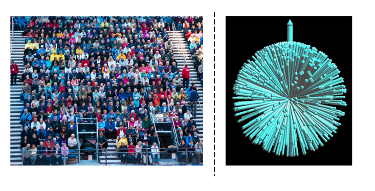
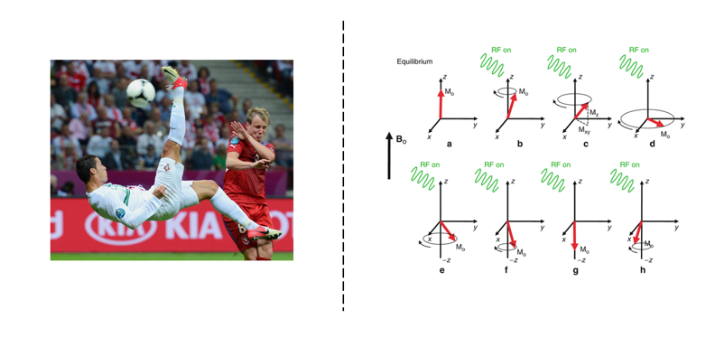
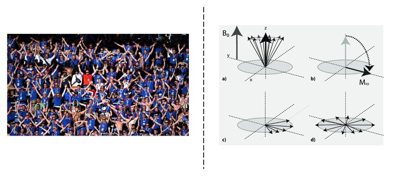
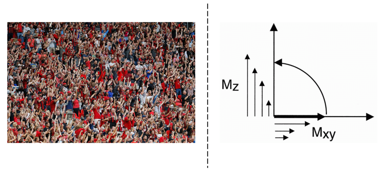

MR Physics Fundamentals
=======================

   Imagine a spinning charge—except it's not a charge and it's not literally spinning.

Trying to understand the Spin
------------------------------

\- *What is spinning in classical view?*

    Every single particle is moving in a circular path around a common center and they all take the same time to finish the circle. Its important to note that individual particles don’t spin, they move in circular path.

    Therefore, a conclusion can be made that Spin is Emergent property in classical physics.

\- *Why electrons can’t spin?*

    Electron is a fundamental particle; it is not made out of anything else (according to our current experiments and theories) [1]_.. For spinning we need group of particles, therefore **electron can’t spin**.

\- *Why its hard to imagine?*

    Because we live in macroscopic world and even the smallest particle we imagine, is still made up of smaller particles.

\- *Then if they don’t spin, why we still think in terms of spinning?*

    Because magnetism arises from moving charge, and if we had a group of charged particles spinning on their own axis we would observe a similar magnetic moment as single electron possesses.

\- *Then why we don’t call that property a “quantum magnet”?*

    Because there is additional property which is also unique to spinning:

    Take a tabletop, which would instantly fall if placed vertically without spinning, however, once it spins, it resists the turning forces (or torques), while performing special motion called precession. The ability of spinning object to resist turning forces is called Angular momentum.

\- *How can we check whether an invisible object is spinning or not?*

    We can apply a turning force and study its reaction, if it does not resist, then it does not have angular momentum, if it resists, then it has an angular momentum, thus spins.

\- *How can we design such an experiment for electron?*

    Using the fact that electrons have magnetic moment, we can put them in stronger magnetic field which will try to re-orient the electron by applying torque to it.

- The key experiment was the :ref:`Stern–Gerlach experiment (1922) <stern-gerlach>`.
- A beam of silver atoms, each carrying a single unpaired electron, was sent through a non-uniform magnetic field.
- If electrons behaved like tiny classical spinning balls, the beam should have spread into a continuous pattern.
- Instead, the beam split cleanly into **two distinct spots** on the detector.
- This revealed that electrons carry **intrinsic angular momentum (spin)**: when the magnetic field tries to reorient them, they resist the turning force (**torque**), just as spinning objects resist being twisted.
- Unlike classical objects, however, electrons can only resist in **two discrete orientations**, showing that their angular momentum is **quantized**.

This experiment **proved** that electron is resisting and thus have an angular momentum.

\- *Summary*

    We saw that charged electron has both angular and magnetic momentum, which are two characteristic properties for spinning charge, but also we assured ourselves that its not actually spinning.
    Its similar to say that an “unknown” animal exists in alien worlds which weights around 1 ton, has a long trunk and big ears and behaves like an elephant, but it is NOT elephant.
    And because we don’t live in alien word, our closest approximation would be to call that animal an “elephant” bearing in mind that still, its not an elephant.

Classical view
--------------

A **single** spin can be pictured as a tiny bar magnet, but MRI measures magnetization in **bulk matter** (more than :math:`10^{23}` spins per liter). Even in strong fields, the macroscopic behavior differs from a single magnet: the static field biases spins while thermal energy randomizes them. The balance gives a non‑zero equilibrium magnetization :math:`M_0`.

Spin: angular momentum and magnetic moment
-----------------------------------------

Nuclei with an odd number of protons and/or neutrons exhibit **spin angular momentum**:

.. math::

   \mathbf{S} = \hbar \mathbf{I}, \qquad \hbar = \frac{h}{2\pi}

The associated magnetic dipole moment is

.. math::

   \boldsymbol{\mu} = \gamma \mathbf{S},

where :math:`\gamma` is the gyromagnetic ratio.

Interaction with magnetic fields
--------------------------------

1. **Static main field** :math:`B_0`

   Spins tend to align with :math:`B_0`, producing :math:`M_0` along :math:`z`. They precess at the **Larmor frequency**:

   .. math::

      \omega_0 = \gamma B, \qquad f = \frac{\omega_0}{2\pi} = \frac{\gamma B}{2\pi}

   Here :math:`B` is the **local** field experienced by the nucleus (shielding leads to **chemical shift**).

2. **RF field** :math:`\mathbf{B}_1(t)`

   The RF field is applied transverse to :math:`B_0` (no :math:`z`‑RF needed). At resonance, :math:`\mathbf{B}_1` tips the magnetization to create transverse components detectable by receiver coils (Faraday’s law). Modern systems often use separate transmit and receive coils optimized for specific anatomy.

3. **Linear gradients** :math:`\mathbf{G}(t)`

   Spatial localization uses linear gradients (e.g., :math:`10\,\mathrm{mT/m}`), superimposed on :math:`B_0` to encode position.

Bloch equation (no relaxation)
------------------------------

Magnetic moment in a field experiences a torque:

.. math::

   \boldsymbol{\tau} = \boldsymbol{\mu} \times \mathbf{B}, \qquad
   \frac{d\mathbf{J}}{dt} = \boldsymbol{\tau}, \qquad
   \boldsymbol{\mu} = \gamma \mathbf{J}

Combining gives the **Bloch precession equation**:

.. math::

   \frac{d\boldsymbol{\mu}}{dt} = \gamma \boldsymbol{\mu} \times \mathbf{B}
   \quad\Longleftrightarrow\quad
   \frac{d\mathbf{M}}{dt} = \mathbf{M} \times \gamma \mathbf{B}.

With :math:`\mathbf{B} = (0,0,B_0)^\mathsf{T}`:

.. math::

   \frac{d}{dt}
   \begin{bmatrix}
   \mu_x\\ \mu_y\\ \mu_z
   \end{bmatrix}
   =
   \gamma
   \begin{bmatrix}
   \mu_y B_0\\ -\mu_x B_0\\ 0
   \end{bmatrix}
   =
   -\omega_0
   \begin{bmatrix}
   \mu_y\\ -\mu_x\\ 0
   \end{bmatrix},
   \qquad \omega_0 = -\gamma B_0 .

Solutions (precession at :math:`\omega_0`):

.. math::

   \mu_x(t) = a\cos(\omega_0 t + \phi),\quad
   \mu_y(t) = a\sin(\omega_0 t + \phi),\quad
   \mu_z(t) = \text{const}.

Rotating frame transformation
-----------------------------

An RF field oscillating at :math:`\omega_0` can be written as

.. math::

   \mathbf{B}_1(t) = B_1
   \begin{bmatrix}
   \cos(\omega_0 t + \phi)\\
   \sin(\omega_0 t + \phi)\\
   0
   \end{bmatrix}.

In a frame rotating at :math:`\omega_0`, this becomes **static**:

.. math::

   \mathbf{B}_1^{(\text{rot})} = B_1
   \begin{bmatrix}
   \cos\phi\\
   \sin\phi\\
   0
   \end{bmatrix}.

Choice of phase :math:`\phi` sets the effective RF axis in the rotating frame.

Bloch equation with relaxation
------------------------------

A phenomenological form including relaxation:

.. math::

   \frac{d\mathbf{M}}{dt}
   = \mathbf{M} \times \gamma \mathbf{B}
     - \frac{M_x \,\hat{\imath} + M_y \,\hat{\jmath}}{T_2}
     - \frac{(M_z - M_0)\,\hat{k}}{T_1},

where :math:`M_0` is the thermal equilibrium magnetization.

Excitation and polarization
---------------------------

A static transverse field has negligible effect; **resonant** :math:`\mathbf{B}_1(t)` is required. A linearly polarized RF field can be decomposed into two counter‑rotating circular components; only the component co‑rotating with the spins is **on‑resonance** (principle behind circularly polarized transmit/receive).

Ignoring relaxation during a short RF pulse:

.. math::

   \frac{d\mathbf{M}}{dt} = \mathbf{M} \times \gamma\big( \mathbf{B}_0 + \mathbf{B}_1(t) \big),
   \qquad \omega_0=\gamma B_0,\ \ \omega_1(t)=\gamma B_1(t).

Relaxation
----------

We lose **transverse** magnetization primarily due to loss of **phase coherence**, not because longitudinal magnetization is reduced by tipping.

- :math:`T_1` (spin–lattice): recovery of :math:`M_z` (typically 100–1500 ms).
- :math:`T_2` (spin–spin): decay of :math:`M_{xy}` from microscopic irreversible dephasing (typically 20–300 ms).
- :math:`T_2^*`: additional macroscopic, reversible dephasing from field inhomogeneity; :math:`T_2^* < T_2`. Good shimming brings :math:`T_2^* \to T_2`.

**Longitudinal relaxation**

.. math::

   \frac{d M_z}{dt} = -\frac{(M_z - M_0)}{T_1}
   \quad\Longrightarrow\quad
   M_z(t) = M_0 + \big(M_z(0)-M_0\big)\,e^{-t/T_1}.

After a :math:`90^\circ` pulse, :math:`M_z(0)=0`:

.. math::

   M_z(t) = M_0 \big(1 - e^{-t/T_1}\big).

**Transverse relaxation**

.. math::

   \frac{d M_{xy}}{dt} = -\frac{M_{xy}}{T_2}
   \quad\Longrightarrow\quad
   M_{xy}(t) = M_{xy}(0)\,e^{-t/T_2}.
   \ (\text{For }90^\circ,\ M_{xy}(0)=M_0)

Signal equation & detection
---------------------------

Signal amplitude is proportional to the transverse magnetization. The received signal is the superposition of contributions over the excited volume:

.. math::

   s(t) = \int_{\text{vol}} M(\mathbf{r},t)\, dV
        = \int\!\!\!\int\!\!\!\int M(x,y,z,t)\, dx\,dy\,dz.

**Quadrature detection** measures two orthogonal channels (cosine/sine), improving SNR and resolving frequency sign (since :math:`\cos(f)=\cos(-f)` but :math:`\sin` changes sign). The complex representation combines them as real and imaginary parts.

T1/T2 Relaxation: A Stadium Story
---------------------------------

On a quiet afternoon, countless people wander through a city, each one going their own way,
facing a random direction. This sprawling, disorganized crowd is our collection of **spins**
in their natural, unaligned state.

   Unaligned state.

Then, an invisible force begins to pull them all toward a single point. Drawn by the magnetic
pull of a massive football stadium, they file in, take their seats, and orient themselves to
face the field. This powerful pull and the collective act of alignment represent the application
of a strong **magnetic field** (:math:`B_0`). Now, the once disorganized crowd is in a state
of quiet, settled **equilibrium**.

   Equilibrium state.

Then, the moment arrives. The home team's striker scores a brilliant goal right in front of the
north stand. This specific, targeted event is like sending a focused **RF pulse excitation**.

   Exciting event (goal for people, RF pulse for spins).

In an instant, only the fans in that section erupt with energy, leaping to their feet and clapping
in a perfect, unified rhythm with a beating drum. The rest of the stadium remains seated, silent.
By only **exciting** a specific part of the crowd, we know exactly where the **signal**—or the
**MR signal**—is coming from. This ability to trigger a response from a precise location is how we
build a full **image**, slice by slice.

But the perfect synchronization can't last. The drum stops, and within a few seconds, the clapping
starts to fall apart. Fans can't maintain the perfect rhythm for long, and their claps begin to drift,
losing their synchronized beat. The time it takes for this unified, organized rhythm to completely fall
apart is the story of **T2 relaxation**. It's a quick, frantic process of losing **phase coherence**.

   T2 relaxation

At the same time, another story is unfolding. After the excitement of the goal, the fans eventually start
to sit back down. But this is a much slower process. One by one, then in small groups, they settle back into
their seats. The time it takes for the entire stadium to fully return to its quiet, seated state is the story
of **T1 relaxation**.

   T1 relaxation.

These two stories happen independently and at very different speeds. The fans' clapping will become
completely disorganized (**T2 relaxation**) in a matter of seconds, long before every single person has
had a chance to fully sit back down and settle in their seat (**T1 relaxation**).

This is the key takeaway: **T2** is always faster than **T1**, and they are two separate processes that
work to bring the **spins** back to their original state.

Magnetism
---------

Biot–Savart law
^^^^^^^^^^^^^^^

The magnetic field contribution :math:`dB` from a current element :math:`I\,d\boldsymbol{\ell}` at point :math:`P` is

.. math::

   dB \propto \frac{I\, d\ell \,\sin\alpha}{R^2}
   \quad\Longrightarrow\quad
   dB = k\, \frac{I\, d\ell \,\sin\alpha}{R^2},

with proportionality constant :math:`k` and distance :math:`R` from the element to :math:`P`.

Ampère’s law
^^^^^^^^^^^^

The line integral of :math:`\mathbf{B}` around a closed loop equals the enclosed current:

.. math::

   \oint \mathbf{B}\cdot d\boldsymbol{\ell} = \mu_0\, I_{\text{enclosed}}.

References
==========

[1] C. Baird, "What is the shape of an electron?", *Science Questions with Surprising Answers*,
    West Texas A&M University, Feb 7, 2014.
    Available at: https://www.wtamu.edu/~cbaird/sq/2014/02/07/what-is-the-shape-of-an-electron/
